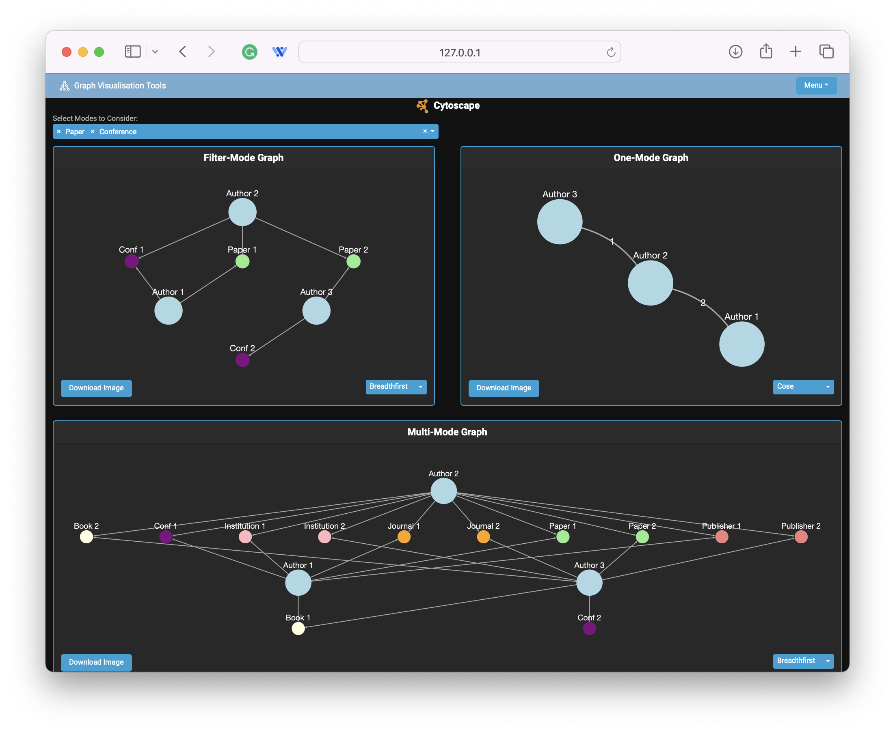
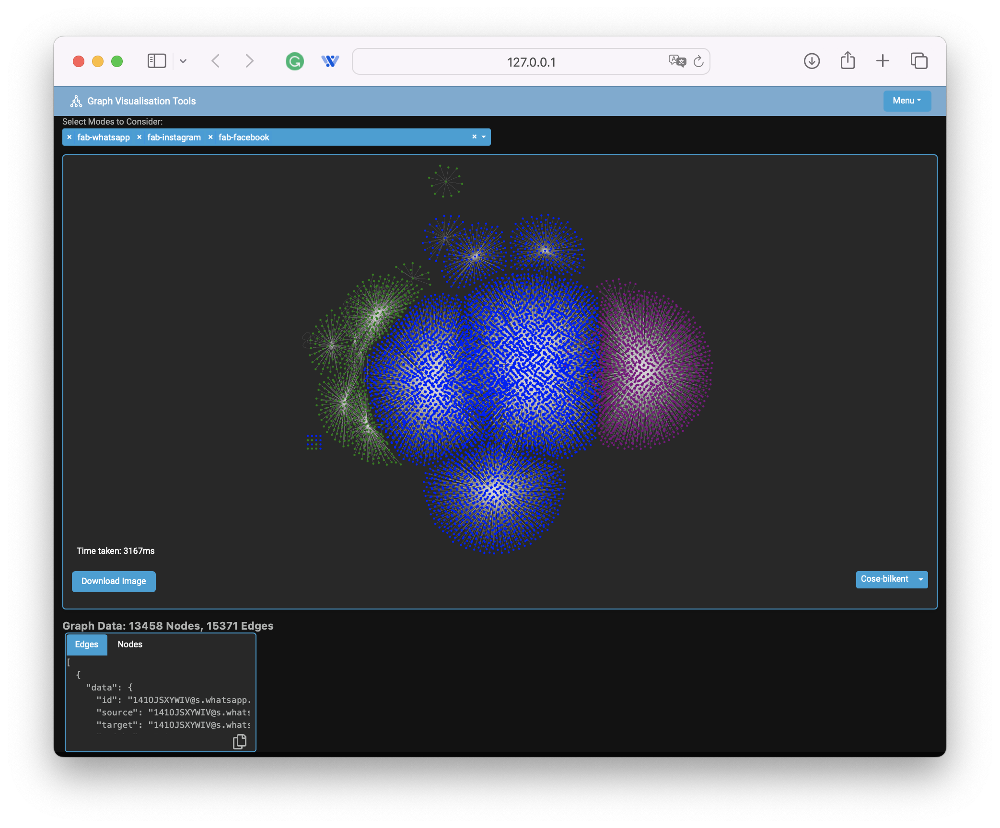

# Graph Visualization Tools

Welcome to the Graph Visualization Tools repository. This project provides an interactive web application for visualizing and analyzing complex multimodal networks using Dash and Cytoscape.js. The application includes several pages, each offering unique features to help users explore and understand their network data.

## Table of Contents

- [User Guide](#user-guide)
- [Features](#features)
  - [Multimode Page](#multimode-page)
  - [Big Data Network Page](#big-data-network-page)
- [Installation](#installation)
- [Usage](#usage)
- [Screenshots](#screenshots)
- [Contributing](#contributing)
- [License](#license)

## User Guide

For detailed instructions on how to use the application, please refer to the [User Guide](user_guide.pdf). The guide provides comprehensive information on all features and functionalities of the application, along with step-by-step usage instructions.

## Features

### Multimode Page

The Multimode page provides three distinct graphs for network analysis:

1. **Main Multimode Graph**: Visualizes the entire network, showing nodes and edges of various types with customizable layouts and interactive elements.
2. **Filtered Subgraph**: Allows users to apply filters to focus on specific parts of the network, dynamically updating the graph based on the selected criteria.
3. **Statistical Overview Graph**: Displays high-level metrics and statistics about the network, such as node degree distribution and centrality measures.

### Big Data Network Page

The Big Data Network page is designed for visualizing a large-scale network. Key features include:

- **Dynamic Graph Display**: Visualizes nodes and edges with different colors based on their attributes.
- **Layout Options**: Multiple layout algorithms are available, such as Breadthfirst, Circle, Concentric, and more.
- **Interactive Context Menu**: Provides options to change node size, isolate nodes, change node shape, mark nodes, and delete nodes.
- **Download Option**: Allows users to download the current graph visualization as an image.
- **Detailed Data View**: Displays detailed information about nodes and edges in a scrollable area.

## Installation

To run this application locally, follow these steps:

1. **Clone the repository**:
    ```bash
    git clone https://github.com/yourusername/graph-visualization-tools.git
    cd graph-visualization-tools
    ```

2. **Install the required dependencies**:
    ```bash
    pip install -r requirements.txt
    ```

3. **Run the application**:
    ```bash
    python app.py
    ```

4. Open your web browser and go to `http://127.0.0.1:8050` to access the application.

## Usage

- **Multimode Page**:
  - Select different modes from the dropdown to visualize different types of nodes and edges.
  - Apply filters to focus on specific parts of the network.
  - Use the layout dropdown to rearrange the graph.

- **Big Data Network Page**:
  - Use the dropdown to select modes and visualize the corresponding nodes and edges.
  - Choose different layouts from the layout dropdown.
  - Interact with nodes using the context menu options.
  - Download the graph as an image using the "Download Image" button.
  - View detailed information about nodes and edges in the scrollable data view.

## Screenshots

### Multimode Page


### Big Data Network Graph Page


## Contributing

We welcome contributions to this project! If you have any ideas, bug reports, or pull requests, please feel free to contribute.

1. Fork the repository.
2. Create a new branch: `git checkout -b feature/your-feature-name`.
3. Make your changes and commit them: `git commit -m 'Add new feature'`.
4. Push to the branch: `git push origin feature/your-feature-name`.
5. Open a pull request.

## License

This project is licensed under the MIT License. See the [LICENSE](LICENSE) file for more details.
